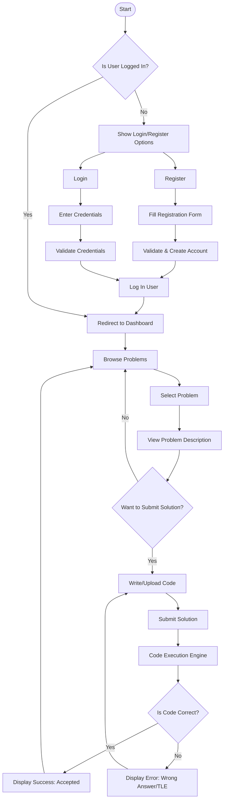

# CodeArena
A fast, scalable platform for solving coding challenges with multi-language support and secure Docker-based execution(possible migration to Firecracker VM??), built in Rust, NodeJs

## Tasks:
- Basic configurations(db, docker, build scripts, ...)
- Rust, NodeJs dependencies
- Github Actions for Rust and Nodejs backends 
- RabbitMq, Redis integrations
- 
## Rust supported endpoints:
- POST /problem 
- GET /problem (get problem by id)
- GET /problems (by limit)
## Routes usage example:
- POST http://127.0.0.1:8080/api/problem?title=new problem 3&body=this is the body of the problem&tags=prob&difficulty=very not hard
- GET http://127.0.0.1:8080/api/problem/2
- GET http://127.0.0.1:8080/api/problems
- GET http://127.0.0.1:8080/api/problems?limit=2
- GET http://127.0.0.1:8080/api/problems/by-tag?tags=greedy,algo
- GET http://127.0.0.1:8080/api/problems/by-tag?tags=greedy,algo&limit=4
## NodeJs Supported endpoints:
- 
- 
## ER Model

