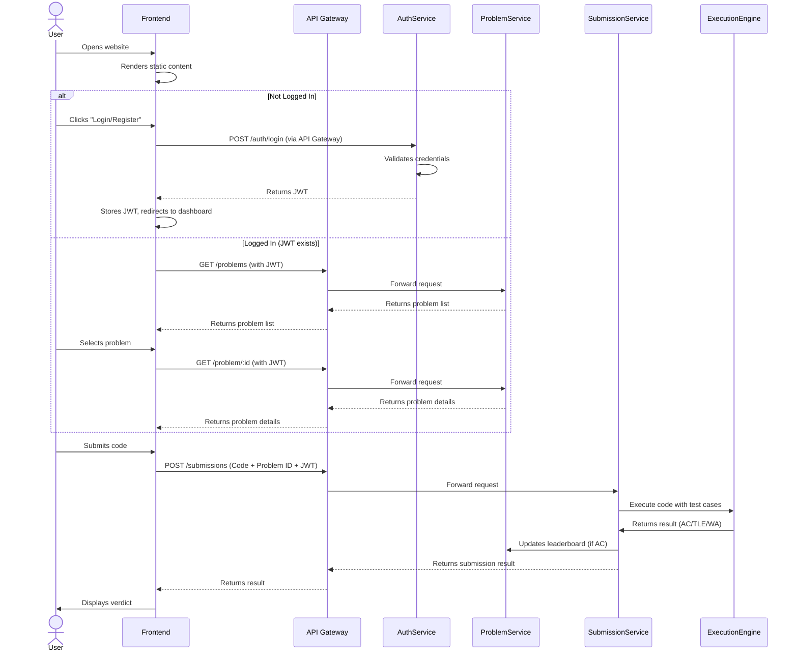

a# CodeArena
A fast, scalable platform for solving coding challenges with multi-language support and secure Docker-based execution(possible migration to Firecracker VM??), built in Rust, NodeJs

## Tasks:
- Basic configurations(db, docker, build scripts, ...)
- Rust, NodeJs dependencies
- Github Actions for Rust and Nodejs backends 
- RabbitMq, Redis integrations
- 
## Rust supported endpoints:
- POST /problem 
- GET /problem (get problem by id)
- GET /problems (by limit)
## Routes usage example:
- POST http://127.0.0.1:8080/api/problem
- GET http://127.0.0.1:8080/api/problem/:id
- GET http://127.0.0.1:8080/api/problems
- GET http://127.0.0.1:8080/api/problems/by-tag

## NodeJs Supported endpoints:
- 
- 
## ER Model

## Activity Diagram:

## Sequence Diagram:

